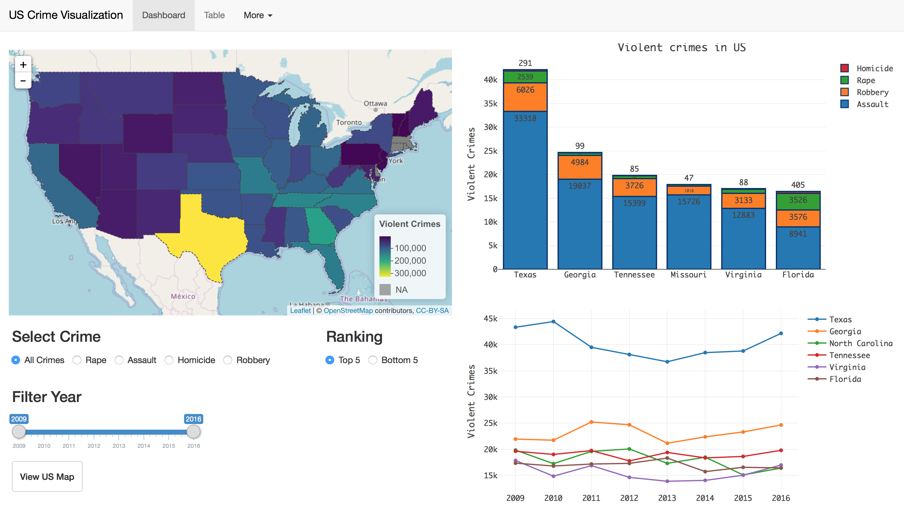
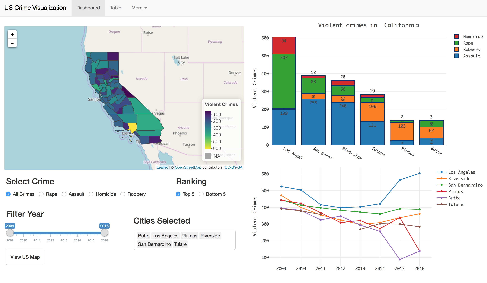
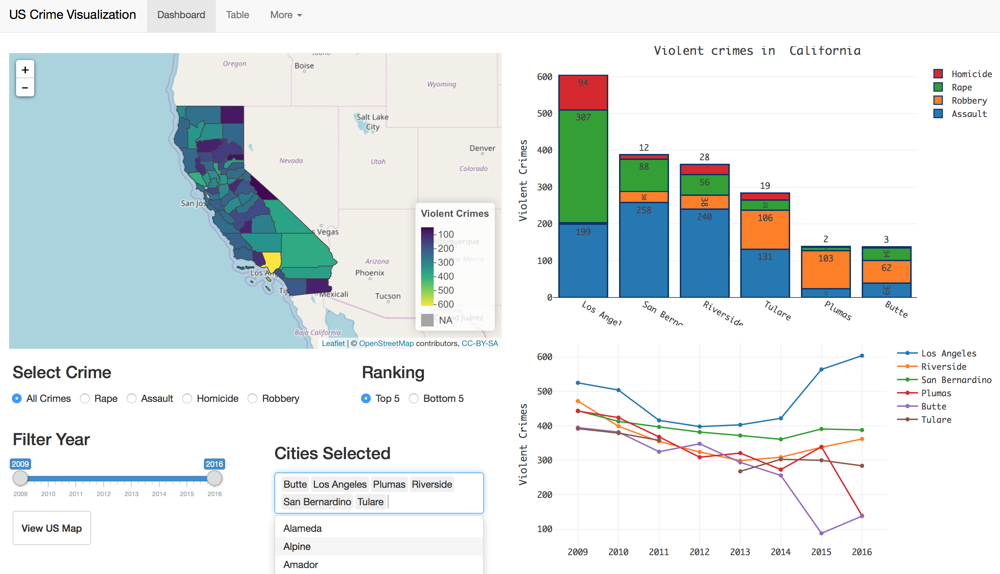

Testing of specific Identity and Access Management (IAM) \& Global Information Security (GIS) p# US County Crime Visualization

**Shiny Application** ->  https://avinashkz.shinyapps.io/CrimeVisualizationUS/

## About the application

The US County Crime Visualization app is developed as an extension to [US Crime Visualization](https://github.com/avinashkz/crime_shiny_app) Application.

Following are the changes I have made in this version:

1. Use LeafletJS for US map
2. Add LeafletJS map for each state
3. Change layout to Navbar from Shiny Dashboard.
4. Add Plotly Bar plot to show the proportion of different types of crime.
5. Use crime statistics data from FBI website to show crime statistics for each county.

## How to use the app?

**As simple as selecting a state by clicking on the US Map.**

## Screenshots of the Application

Overview of crime in the US.

Crime in California counties.

Add or remove extra counties or states to the Bar and Line plot.

